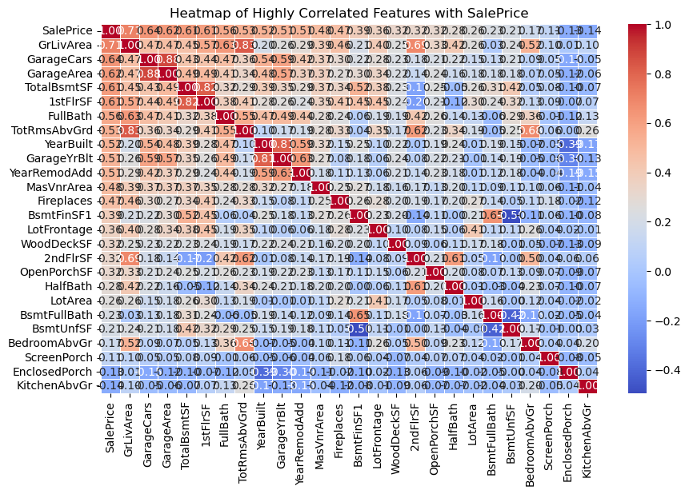

# House-Price-Prediction
This project was created for the [Kaggle Housing Prices Competition for Kaggle Learn Users](https://www.kaggle.com/competitions/home-data-for-ml-course) competition.   The goal is to predict the final sale price of residential homes using various machine learning regression models. We achieved a top 1% ranking (56th out of 6,980 participants) in this kaggle competition on 12th March 2025.

## Project Overview
- Performed **data cleaning**, **feature engineering**, and **exploratory data analysis (EDA)** to understand the dataset.  
- Built and compared multiple regression models:
  - Linear Regression  
  - Ridge, Lasso & ElasticNet Regression
  - Support Vector Regression
  - Random Forest, Gradient Boosting, and XGBoost  
- Used **cross-validation** and **hyperparameter tuning** to improve performance.  

## Key Visualizations

**Correlation with SalePrice** — Heatmap of the numerical features most correlated with SalePrice. `OverallQual`, `GrLivArea`, `GarageCars`/`GarageArea`, and `TotalBsmtSF` stand out as the strongest predictors.

**Target distribution** — SalePrice is right-skewed, with most homes selling between roughly $100K–$250K and a long tail of higher-priced outliers, motivating a log transform before modeling.

**Feature importance (XGBoost)** — The final XGBoost model ranks `ExterQual`, `OverallQual`, and `GarageCars` as the top drivers of predicted sale price, followed by basement/kitchen quality and living area.

**Predicted vs. actual prices** — Predictions from the tuned XGBoost model track closely with actual sale prices along the ideal line, with a slight spread at the highest price points.

## Notebook
View the full notebook in the house_price_prediction.ipynb file above.

## Acknowledgments
Special thanks to my teammates at ENSIIE, **Tito KOH, Alessio BALDINI and lamiaa EL OUATILI**, for their collaboration and contributions to this project.
