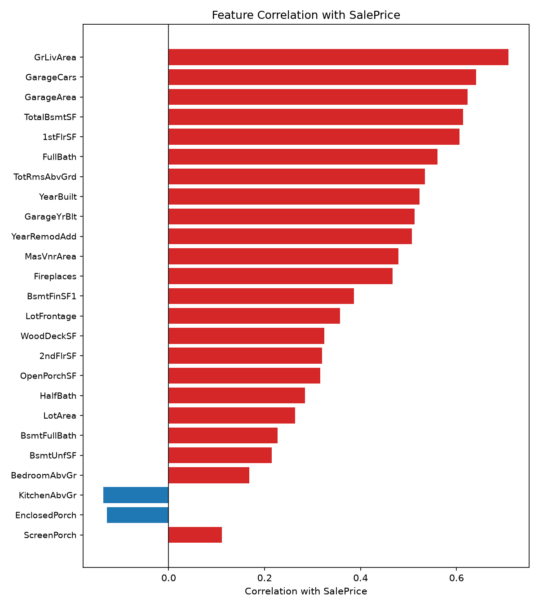
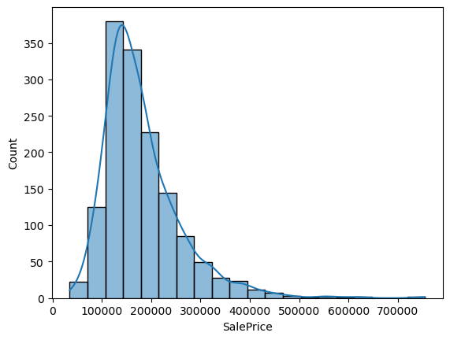
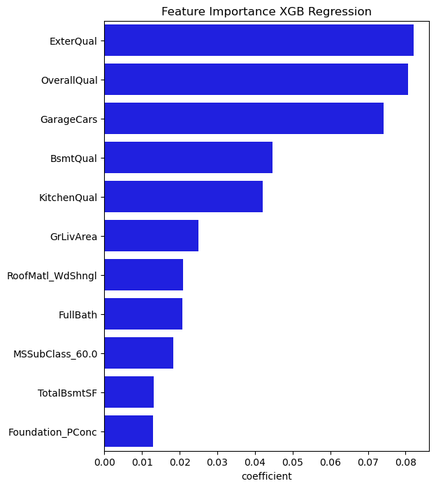
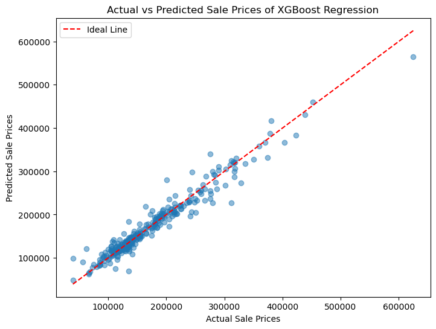

# House-Price-Prediction
This project was created for the [Kaggle Housing Prices Competition for Kaggle Learn Users](https://www.kaggle.com/competitions/home-data-for-ml-course) competition.   The goal is to predict the final sale price of residential homes using various machine learning regression models. We achieved a top 1% ranking (56th out of 6,980 participants) in this kaggle competition on 12th March 2025.

## Project Overview
- Performed **data cleaning**, **feature engineering**, and **exploratory data analysis (EDA)** to understand the dataset.  
- Built and compared multiple regression models:
  - Linear Regression  
  - Ridge, Lasso & ElasticNet Regression
  - Support Vector Regression
  - Random Forest, Gradient Boosting, and XGBoost  
- Used **cross-validation** and **hyperparameter tuning** to improve performance.  

## Key Visualizations

**Correlation with SalePrice** — Numerical features ranked by their correlation with SalePrice. `GrLivArea`, `GarageCars`/`GarageArea`, and `TotalBsmtSF` stand out as the strongest predictors; `KitchenAbvGr` and `EnclosedPorch` are the only two with a (weak) negative correlation.

**Target distribution** — SalePrice is right-skewed, with most homes selling between roughly $100K–$250K and a long tail of higher-priced outliers, motivating a log transform before modeling.

**Feature importance (XGBoost)** — The final XGBoost model ranks `ExterQual`, `OverallQual`, and `GarageCars` as the top drivers of predicted sale price, followed by basement/kitchen quality and living area.

**Predicted vs. actual prices** — Predictions from the tuned XGBoost model track closely with actual sale prices along the ideal line, with a slight spread at the highest price points.

## Results

All models were evaluated on the same held-out test split using RMSE and R². **XGBoost** performed best and was used for the final Kaggle submission.

| Model | RMSE | R² |
|---|---:|---:|
| Support Vector Regression | 41,597.76 | 0.7225 |
| Decision Tree | 33,629.45 | 0.8186 |
| Random Forest | 22,553.24 | 0.9184 |
| Ridge Regression | 20,209.02 | 0.9345 |
| Gradient Boosting | 19,500.06 | 0.9390 |
| Linear Regression | 19,671.53 | 0.9379 |
| Lasso Regression | 19,068.94 | 0.9417 |
| Elastic Net | 19,072.32 | 0.9417 |
| **XGBoost (final)** | **18,490.73** | **0.9452** |

## Tech Stack

- **Python**
- **Pandas / NumPy**
- **Scikit-learn**
- **XGBoost**
- **Matplotlib / Seaborn**

## Notebook
View the full notebook in the house_price_prediction.ipynb file above.

## Acknowledgments
Special thanks to my teammates at ENSIIE, **Tito KOH, Alessio BALDINI and lamiaa EL OUATILI**, for their collaboration and contributions to this project.

